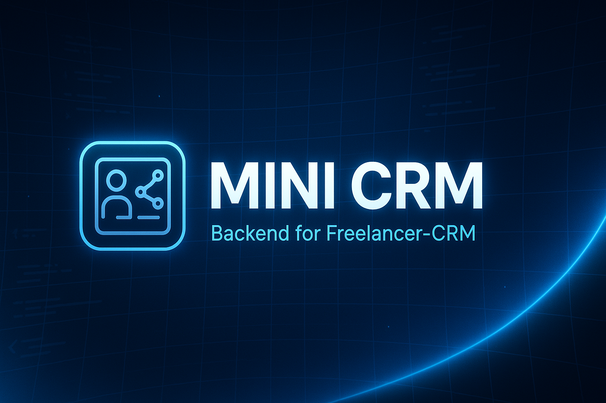

# Mini CRM Backend

A comprehensive Customer Relationship Management (CRM) backend API built with Go, Gin framework, and GORM. This system provides a robust foundation for managing customer relationships, deals, tasks, and notes through a RESTful API.



## Overview

This backend API is designed with modern architecture principles and provides a complete set of endpoints for a CRM system. It includes authentication, authorization, and full CRUD operations for all necessary entities in a CRM application.

## Technology Stack

- **Language**: Go (1.17+)
- **Web Framework**: Gin
- **ORM**: GORM
- **Database**: PostgreSQL
- **Authentication**: JWT with role-based access control
- **Validation**: go-playground/validator
- **Logging**: Structured logging with logrus
- **Documentation**: Swagger/OpenAPI
- **Monitoring**: Prometheus metrics
- **Security**: 
  - Rate limiting with IP-based restrictions
  - Request size limiting
  - CORS configuration
  - API key validation
  - Content security policies

## Features

### Authentication & Authorization
- Secure JWT-based authentication
- Role-based access control (admin/user roles)
- Resource ownership validation
- Refresh token mechanism
- Mobile-specific authentication endpoints
- Protection against brute-force attacks with stricter rate limiting for auth endpoints

### Data Management
- Complete CRUD operations for all entities
- Relationship management between all models
- Structured response format for consistent API
- Data validation using go-playground/validator

### Monitoring & Operations
- Health check endpoints for container orchestration (`/health` and `/ready`)
- Prometheus metrics for monitoring (admin-protected)
- Structured logging with request tracking
- Configurable log levels

### Developer Experience
- Comprehensive Swagger documentation with interactive testing
- Special test mode for UI development
- Test data seeding capabilities
- Standardized error responses

## Data Models

The system includes the following core data models with appropriate relationships:

1. **User**
   - Core attributes: Username, Email, Password (encrypted), Role
   - Validation: Email format, username length, password strength
   - Relationships: One-to-one with Settings, one-to-many with Contacts, Deals, Tasks, Notes

2. **Contact**
   - Core attributes: First Name, Last Name, Email, Phone, etc.
   - Relationships: Belongs to User, has many Deals and Notes

3. **Deal**
   - Core attributes: Title, Description, Value, Status
   - Relationships: Belongs to Contact and User, has many Tasks

4. **Task**
   - Core attributes: Title, Details, Due Date, Completed Status
   - Relationships: Belongs to Deal and User

5. **Note**
   - Core attributes: Content, timestamps
   - Relationships: Can belong to Contact, Deal, and User

6. **Settings**
   - Core attributes: Theme, Language
   - Relationship: Belongs to User

## Getting Started

### Prerequisites

- Go 1.17 or higher
- PostgreSQL 12 or higher
- Docker & Docker Compose (optional, for containerized setup)

### Installation

1. Clone the repository:
```bash
git clone https://github.com/yourusername/mini-crm.git
cd mini-crm
```

2. Set up environment variables:
   Create a `.env` file in the backend directory with the following variables:

```
DB_HOST=localhost
DB_PORT=5432
DB_USER=postgres
DB_PASSWORD=yourpassword
DB_NAME=mini_crm
JWT_SECRET_KEY=your-secret-key
JWT_EXPIRATION_HOURS=24
PORT=8081
ENV=development
ALLOWED_ORIGINS=http://localhost:3000
LOG_LEVEL=info
```

3. Install backend dependencies:
```bash
cd backend
go mod download
```

4. Start the backend server:
```bash
# Run directly
go run main.go

# Using make commands
make run         # Standard run
make run-dev     # Development mode with hot reload

# Using Docker
docker-compose up -d
```

### Initial Access

The system creates a default admin user on first run:
- Username: `admin`
- Email: `admin@example.com`
- Password: `admin123`

**Important**: Change these credentials immediately in a production environment.

## API Documentation

### Base URL

The API is accessible at:
```
http://localhost:8081/api/v1
```

### Authentication

All protected endpoints require a valid JWT token in the Authorization header:
```
Authorization: Bearer YOUR_JWT_TOKEN
```

To obtain a token, send a POST request to `/api/v1/auth/login` with valid credentials.

### Key Endpoints

#### Authentication
- `POST /api/v1/auth/register` - Register new user
- `POST /api/v1/auth/login` - Login
- `GET /api/v1/auth/me` - Get current user
- `POST /api/v1/auth/refresh` - Refresh token
- `POST /api/v1/auth/mobile/login` - Mobile-optimized login
- `POST /api/v1/auth/mobile/refresh` - Mobile-optimized token refresh

#### Users (admin privileges required for some endpoints)
- `GET /api/v1/users` - List all users
- `GET /api/v1/users/:id` - Get user by ID
- `POST /api/v1/users` - Create user (admin only)
- `PUT /api/v1/users/:id` - Update user
- `DELETE /api/v1/users/:id` - Delete user (admin only)

#### Contacts
- `GET /api/v1/contacts` - List user's contacts
- `GET /api/v1/contacts/:id` - Get contact by ID
- `POST /api/v1/contacts` - Create contact
- `PUT /api/v1/contacts/:id` - Update contact
- `DELETE /api/v1/contacts/:id` - Delete contact

Similar endpoints exist for **Deals**, **Notes**, **Tasks**, and **Settings**.

### Interactive Documentation

1. Access the Swagger UI at `/swagger/index.html` when running in development mode
2. For a complete collection of API requests, import the file `mini_crm_api_complete.json` into Postman

## Security Features

### Authentication & Authorization
- JWT tokens with configurable expiration
- Separate middleware for admin-only routes
- Resource ownership verification on all operations
- Password encryption with bcrypt

### Request Protection
- IP-based rate limiting with different thresholds for sensitive endpoints
- Request size limiting (default: 10MB) to prevent DoS attacks
- CORS configuration with environment-specific settings
- Content Security Policy headers

### API Security
- API key validation for external applications
- Protection against common web vulnerabilities
- Security headers (X-Content-Type-Options, X-Frame-Options, etc.)

### Operational Security
- Detailed request logging with unique request IDs
- Configurable log levels based on environment
- Prometheus metrics for monitoring (protected by admin authentication)
- Environment-specific security configurations

## Development Features

### Logging System

The application uses structured logging with configurable levels:

- **debug**: Detailed information for debugging
- **info**: General operational information
- **warn**: Warning conditions that should be addressed
- **error**: Error conditions that affect functionality

Logs include contextual information such as request ID, user ID (when authenticated), IP address, and timing information.

### API Documentation

Comprehensive Swagger/OpenAPI documentation is integrated:

- Access the interactive UI at `/swagger/index.html` in development mode
- Test endpoints directly from the browser
- View complete request/response models
- Export documentation in JSON or YAML format

In production, Swagger is disabled by default but can be enabled with the `ENABLE_SWAGGER=true` environment variable.

### Health Monitoring

- `/health` endpoint provides system health information
- `/ready` endpoint for container orchestration readiness probes
- Prometheus metrics at `/metrics` (admin-protected)

## UI Development Mode

The backend includes a specialized mode for frontend development, making it easier to work on the UI without managing authentication and test data manually.

### Activating Test Mode

1. Configure the environment by using the `.env.development` file with these settings:
   ```
   # Core test mode settings
   UI_TEST_MODE=true
   SEED_TEST_DATA=true
   
   # Test user credentials
   UI_TEST_USER=admin@example.com
   UI_TEST_PASSWORD=test1234
   
   # Authentication bypass (use with caution)
   DISABLE_AUTH_FOR_TESTS=false
   ```

2. Start the server in development mode:
   ```bash
   make run-dev
   ```

### Features

- **Test Data Generation**: Creates realistic sample data including users, contacts, deals, tasks, and notes
- **Authentication Helpers**: Simplified authentication for development
- **Automatic CORS**: Development origins are automatically allowed
- **Diagnostic Headers**: Special headers indicate test mode is active

### Security Notice

This mode is designed only for development. The server automatically disables these features in production, but as an additional precaution, never deploy with these settings enabled.

## Project Structure

```
/backend
├── cmd/           # Application entry point
├── config/        # Database and application configuration
├── controllers/   # API endpoint handlers for all models
├── middleware/    # HTTP middleware components
├── models/        # Data models and database schema
├── routes/        # API route definitions
├── utils/         # Helper functions and shared utilities
├── main.go        # Main application file
├── go.mod         # Go module definition
├── go.sum         # Go module checksums
└── Dockerfile     # Container definition
```

### Extending the Backend

1. Add new models in `/models`
2. Create corresponding controllers in `/controllers`
3. Register new routes in `/routes/router.go`
4. Add models to the migration list in `main.go`

## Deployment

The application can be deployed in several ways:

1. **Standard Go deployment**
   - Build the binary with `go build`
   - Deploy with proper environment variables

2. **Docker deployment**
   - Use the included Dockerfile
   - Configure with environment variables

For detailed instructions, see the [Deployment Guide](backend/DEPLOYMENT_GUIDE.md).

## Contributing

Contributions are welcome! Please follow these steps:

1. Fork the repository
2. Create your feature branch (`git checkout -b feature/amazing-feature`)
3. Commit your changes (`git commit -m 'Add some amazing feature'`)
4. Push to the branch (`git push origin feature/amazing-feature`)
5. Open a Pull Request

## License

This project is licensed under the MIT License with an attribution clause - see the [LICENSE](LICENSE) file for details.

## Acknowledgements

- [Gin Web Framework](https://github.com/gin-gonic/gin)
- [GORM](https://gorm.io/)
- [JWT Go](https://github.com/golang-jwt/jwt)
- [Logrus](https://github.com/sirupsen/logrus)
- [Swagger](https://github.com/swaggo/swag)
- [Prometheus](https://prometheus.io/)
